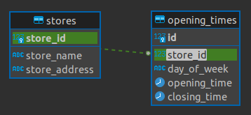

# FT-task

## Features

API routes

| HTTP   | URI         | CRUD Operation            | View name |
| ------ | ----------- | ------------------------- | --------- |
| GET    | /stores/    | list all stores           | LIST      |
| POST   | /stores/    | create a new store        | LIST      |
| GET    | /stores/id/ | retrieve a specific store | DETAIL    |
| PUT    | /stores/id/ | update a specific store   | DETAIL    |
| DELETE | /stores/id/ | delete a specific store   | DETAIL    |

Pagination

Filtering

Docker

Error codes

- 400 Bad Request
- 401 Unauthorised
- 403 Forbidden
- 404 Not Found

## Tools & Technologies used

- [Python](https://www.python.org) used as the back-end programming language.
- [PostgreSQL](https://www.postgresql.org) used as the relational database management.
- [Visual Studio Code](https://code.visualstudio.com/) used as a local IDE for development.
- [Black](https://pypi.org/project/black/) used as a PEP8 compliant Python code formatter
- [DBeaver](https://dbeaver.io/) used to produce ERDs and help plan the database models

## Database Design

An Entity Relationship Diagram (ERD) was created using [DBeaver](https://dbeaver.io/) in order to visualize the database architecture before creating Django models.

## Testing

## Deployment

### Local Deployment

#### Cloning

#### Forking
